# oru_phones

A Flutter project following the **Model-View-ViewModel (MVVM)** architecture with **Stacked** state management.

## 📌 Overview

oru_phones is a Flutter-based mobile application that leverages the **Stacked** package to implement the **MVVM** architecture, ensuring a clean separation of concerns and scalable code structure.

## 🏗 Architecture

This project follows the **Model-View-ViewModel (MVVM)** architecture using **Stacked** for state management. Below is a brief overview of the structure:

- **Model**: Defines the data structure and business logic.
- **View**: Handles UI components and user interactions.
- **ViewModel**: Connects the Model and View, managing the app's state and logic.

Stacked simplifies state management, navigation, dependency injection, and service location within the MVVM structure.

## ⚡ State Management

This project uses the **Stacked** package for state management, which provides:
- Reactive ViewModels for managing state.
- Service-based dependency management.
- Simplified navigation handling.

## 🚀 Getting Started

Follow these steps to set up and run the project locally:

### Prerequisites
Ensure you have the following installed:
- [Flutter SDK](https://flutter.dev/docs/get-started/install)
- Dart SDK
- Android Studio or Visual Studio Code
- A device/emulator for testing

### 📥 Installation

1. Clone the repository:
   ```sh
   git clone https://github.com/your-username/oru_phones.git
   cd oru_phones
   ```
2. Install dependencies:
   ```sh
   flutter pub get
   ```
3. Run the application:
   ```sh
   flutter run
   ```

### 🛠 Directory Structure
```
oru_phones/
│-- lib/
│   ├── app/
│   │   ├── app.locator.dart
│   │   ├── app.router.dart
│   ├── models/
│   ├── services/
│   ├── ui/
│   │   ├── views/
│   │   ├── widgets/
│   ├── viewmodels/
│   ├── main.dart
│-- pubspec.yaml
```

- **app/**: Manages app-wide services, routing, and dependency injection.
- **models/**: Defines data structures.
- **services/**: Contains business logic and API handling.
- **ui/views/**: Holds UI screens.
- **ui/widgets/**: Contains reusable widgets.
- **viewmodels/**: Stores ViewModel classes for managing state.
- **main.dart**: Entry point of the application.

## 🖼 Screenshots

### Home Page
 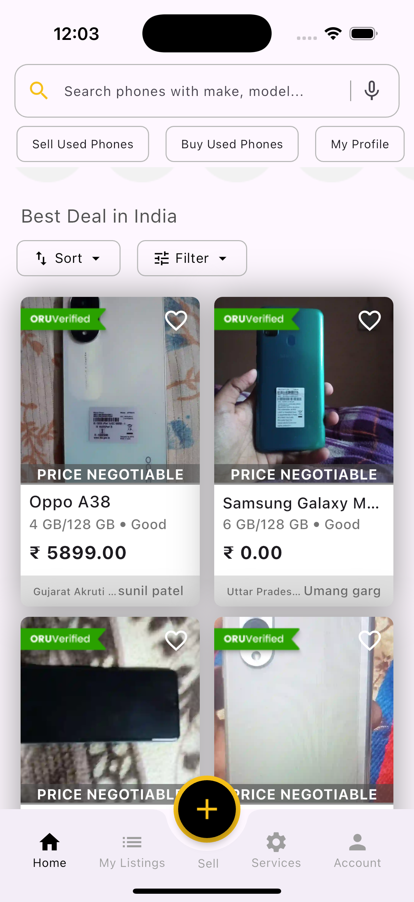
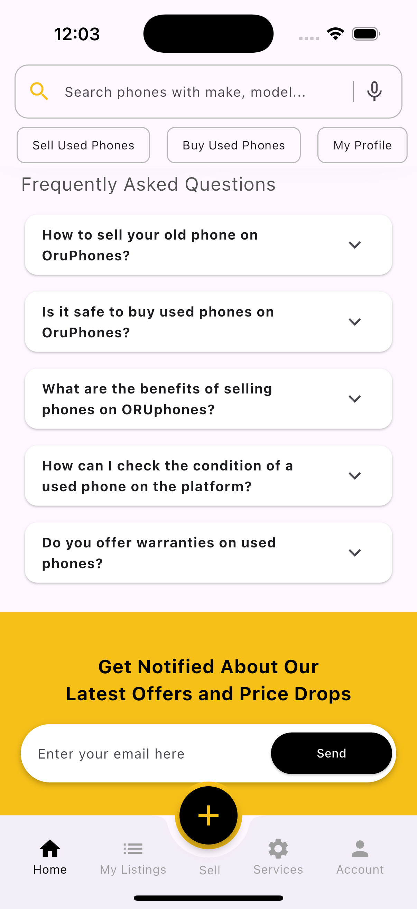 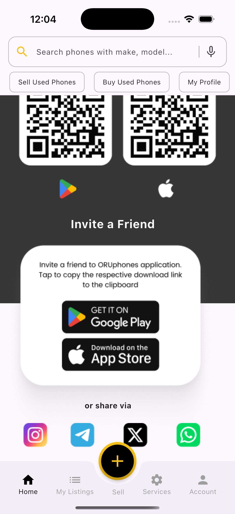

### Side Bar
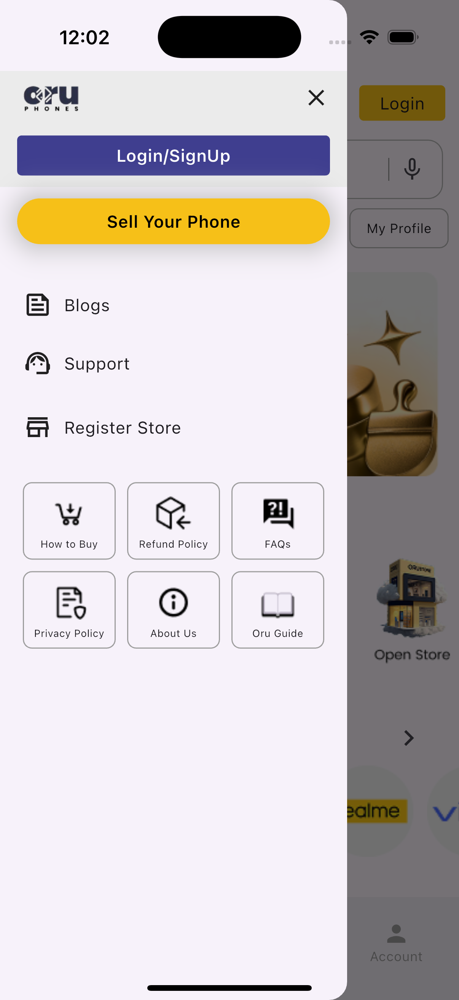 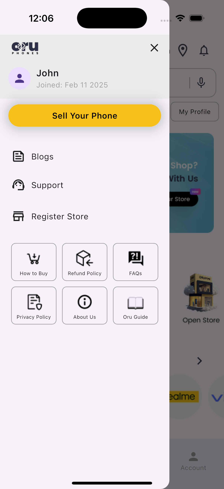

### Filters
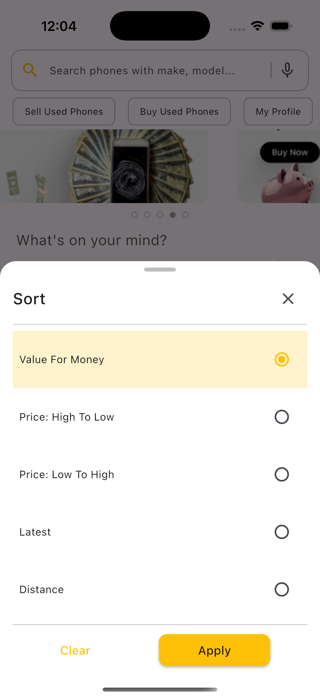 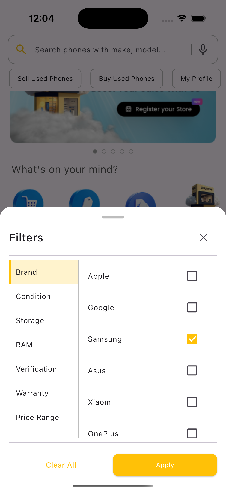
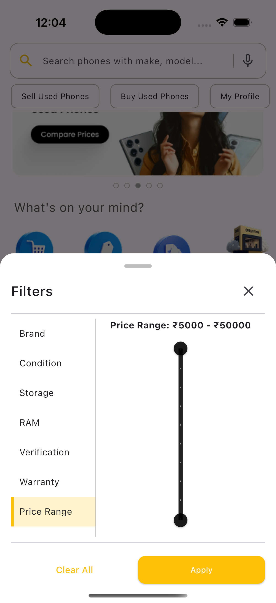 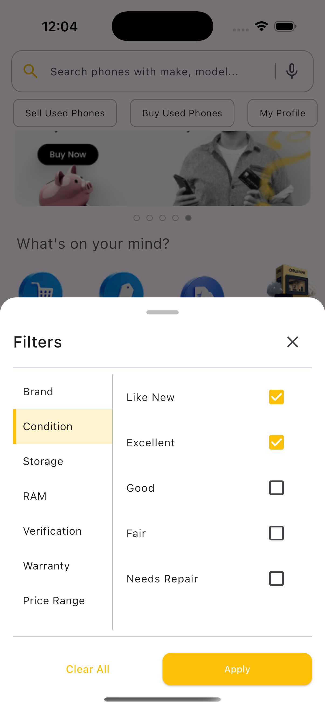
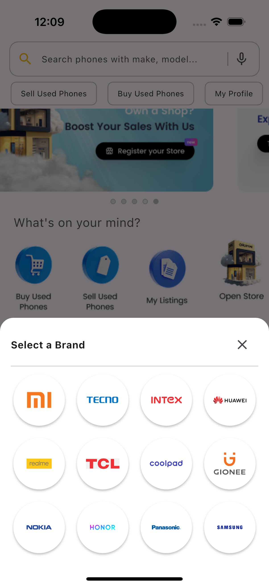 


### Authentication Pages
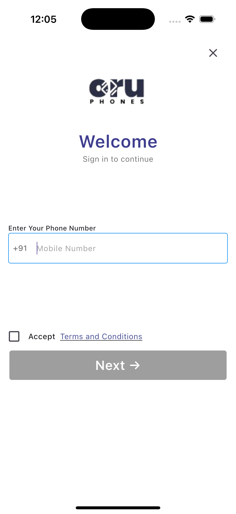 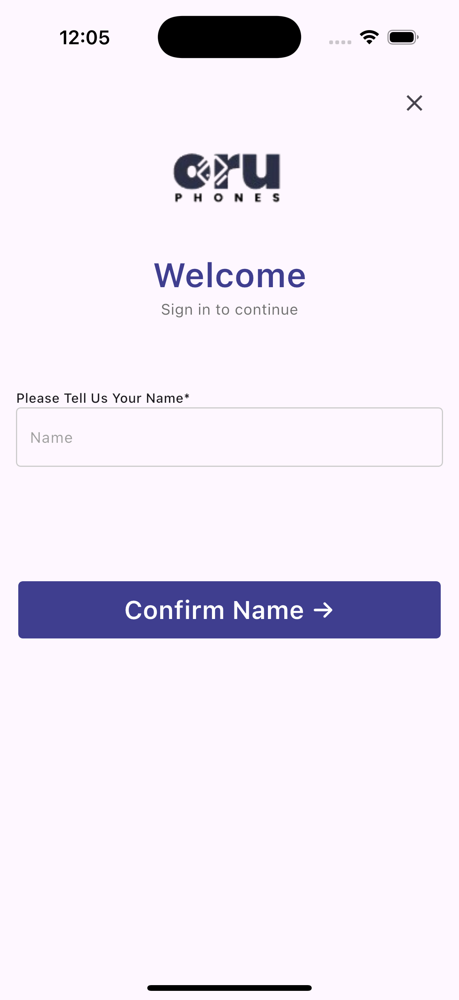
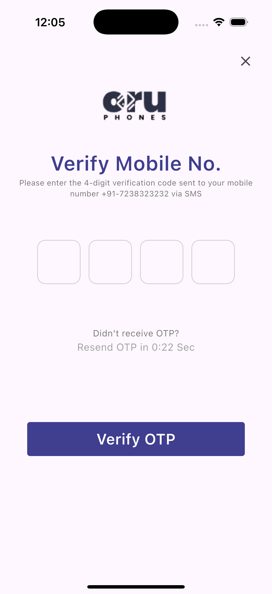


## 🔗 Resources
- [Stacked Documentation](https://www.filledstacks.com/post/flutter-and-provider-architecture-using-stacked/)
- [Flutter Documentation](https://docs.flutter.dev/)

## 📜 License
This project is licensed under the MIT License.

